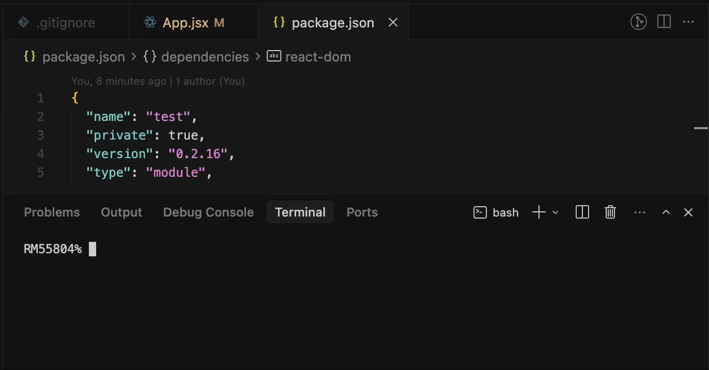

# @niazox/auto-bump-version

[](https://www.npmjs.com/package/@niazox/auto-bump-version)
[](https://github.com/grishbar/auto-bump-version/actions/workflows/ci.yml)

A tiny utility with almost no setup: every new commit against the base branch bumps `package.json` version by **1** (patch). Same command locally (Husky pre-commit) and in CI (`--check-only`).



It keeps the version **not below** `origin/<base>`. If local equals origin, it increments the patch and stages `package.json`. If it is behind, the hook fails (unless you run `--post-rebase`, which jumps to origin patch+1 and amends HEAD). Baseline is always `origin/<branch>`, never the local branch tip.

The default comparison branch is **`main`**. Override with `--base-branch` (for example `--base-branch develop`).

## Install

```bash
npm i -D @niazox/auto-bump-version husky
npx auto-bump-version init
```

`init` asks for your default branch (Enter keeps `main`), then writes Husky hooks and `.github/workflows/check-version.yml`. Use `--yes` to skip the prompt, or `--base-branch develop` to set it without asking.

## Husky

Pre-commit (same pattern as a typical `node …/bumpVersionPrecommitCli.js` hook):

```sh
# .husky/pre-commit
npx auto-bump-version
```

After rebase, bump and amend only when the hook argument is `rebase` (skip `amend` to avoid a loop):

```sh
# .husky/post-rewrite
if [ "$1" = "rebase" ]; then
  npx auto-bump-version --post-rebase
fi
```

## CI

`--check-only` does not write files. Fetch is shallow (`--depth=1`) only in this mode so local clones stay non-shallow.

On GitHub pull requests it uses `GITHUB_BASE_REF` when `--base-branch` is not set. On GitLab MRs it uses `CI_MERGE_REQUEST_TARGET_BRANCH_NAME`.

### GitHub Actions

`init` already writes this workflow. You can also add it by hand:

```yaml
# .github/workflows/check-version.yml
name: Check version

on:
  pull_request:

jobs:
  check-version:
    runs-on: ubuntu-latest
    steps:
      - uses: actions/checkout@v4
      - uses: grishbar/auto-bump-version@main
        with:
          base-branch: main
```

Or call the CLI after checkout:

```yaml
- run: npx auto-bump-version --check-only --base-branch main
```

## Flags

| Flag | Meaning |
| --- | --- |
| `--check-only` | Verify `current >= origin`; no writes. Incompatible with `--post-rebase`. |
| `--post-rebase` | If equal or behind origin, bump to origin patch+1, stage, and `git commit --amend --no-edit --no-verify`. |
| `--base-branch <name>` | Compare against `origin/<name>` instead of `main`. Also `--base-branch=<name>`. |
| `init` | Write Husky hooks and a GitHub Actions workflow. Asks for the default branch unless `--yes` / `--base-branch` is set. |

## Environment

| Variable | Meaning |
| --- | --- |
| `BUMP_VERSION_PROJECT_ROOT` | Directory that contains the host `package.json` (takes precedence). |
| `VERSION_CHECK_ROOT` | Same as `BUMP_VERSION_PROJECT_ROOT`. |
| `VERSION_CHECK_BASE_BRANCH` | Fallback base branch in `--check-only` when CLI and CI target are unset. |
| `CI_MERGE_REQUEST_TARGET_BRANCH_NAME` | GitLab MR target; used in `--check-only` after CLI `--base-branch`. |
| `GITHUB_BASE_REF` | GitHub pull request base branch; used in `--check-only` after the GitLab variable. |

Without those, the CLI walks up from `process.cwd()` to the nearest `package.json`, so it works when installed under `node_modules`.

## Version rules

- Accepted forms: `N.N.N` or `N.N.N-suffix` (any number of numeric segments, e.g. `1.0` or `1.2.3.4`).
- A suffix on the MR side is **not older** than the same numeric base on origin (`14.2.1-fix` > `14.2.1`).
- During rebase or cherry-pick (`REBASE_HEAD`, `CHERRY_PICK_HEAD`, `rebase-merge`, `rebase-apply`), local pre-commit / post-rebase **skip** so `git --continue` is not blocked. `--check-only` still enforces the constraint.

## Programmatic API

```ts
import {
  bumpPatch,
  compareVersionForMinConstraint,
  nextVersionAgainstOrigin,
  parseProjectVersion,
  resolveBaseBranch,
} from '@niazox/auto-bump-version';

bumpPatch('14.2.1'); // '14.2.2'
nextVersionAgainstOrigin('14.2.1', '14.2.5'); // { cmp: -1, next: '14.2.6' }
```

Also exported: `parseBumpVersionCliArgs`, `isRebaseOrCherryPickInProgress`, `DEFAULT_BASE_BRANCH`, `GIT_REBASE_OR_CHERRY_PICK_MARKERS`.

## License

MIT
